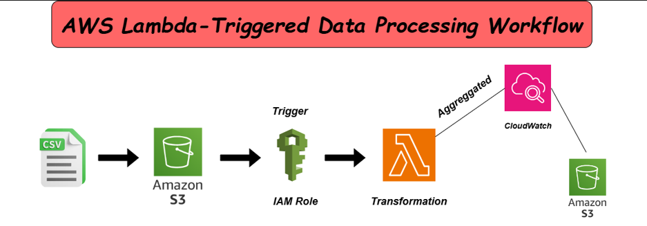

# S3 to S3 Data Transformation Pipeline

## Project Overview

This project is an automated data processing pipeline that leverages AWS services to handle CSV data, perform transformations, and monitor processes efficiently. The architecture is designed to be serverless, scalable, and event-driven, ensuring minimal operational overhead and high reliability.

## Architecture Components
1. **Amazon S3**: Serves as the primary storage for input and output data. CSV files are stored in an S3 bucket as the data source and processed results are saved back into another S3 bucket.
2. **IAM Role**: Ensures secure access control, allowing the Lambda function to interact with S3 buckets and CloudWatch for logging.
3. **AWS Lambda**: Acts as the transformation engine. When a new CSV file is uploaded to the source S3 bucket, Lambda is triggered to process and transform the data.
4. **Amazon CloudWatch**: Monitors and logs the entire transformation process, providing insight into function execution, errors, and performance metrics.

## Data Flow
1. **File Upload**: A CSV file is uploaded to the source S3 bucket.
2. **Trigger**: The upload triggers an event that invokes the Lambda function using an IAM role for secure access.
3. **Transformation**: The Lambda function processes and aggregates the data as required.
4. **Logging**: CloudWatch captures logs and metrics for monitoring and debugging purposes.
5. **Output Storage**: The transformed data is saved into a target S3 bucket for downstream use or further processing.

## Use Cases
- Automated data ingestion and transformation workflows.
- Real-time data processing for analytics and reporting.
- Scalable ETL (Extract, Transform, Load) solutions with serverless computing.

## Benefits
- **Scalability**: The serverless nature of AWS Lambda scales automatically with the workload.
- **Cost Efficiency**: Pay-as-you-go pricing ensures cost-effectiveness, only incurring charges when the function runs.
- **Monitoring**: CloudWatch provides detailed logs and metrics to monitor the pipeline's health and performance.

## How to Use
1. Upload a CSV file to the source S3 bucket.
2. The Lambda function is triggered, processes the data, and outputs the results to the designated target S3 bucket.
3. Monitor the transformation and aggregation through CloudWatch logs.

Most welcome to explore and modify this pipeline according to your data processing needs!
